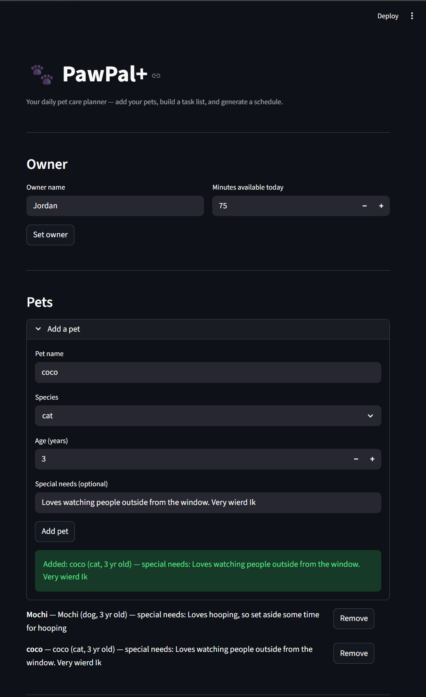
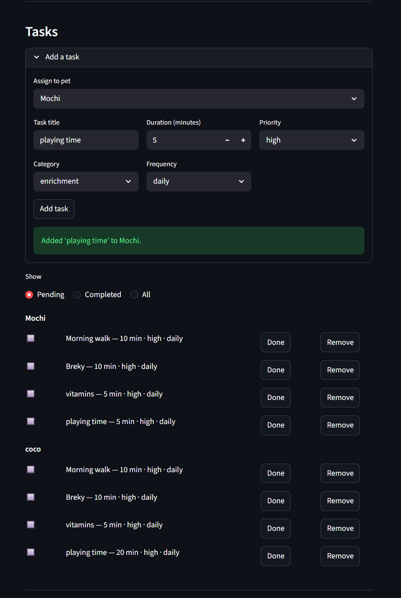
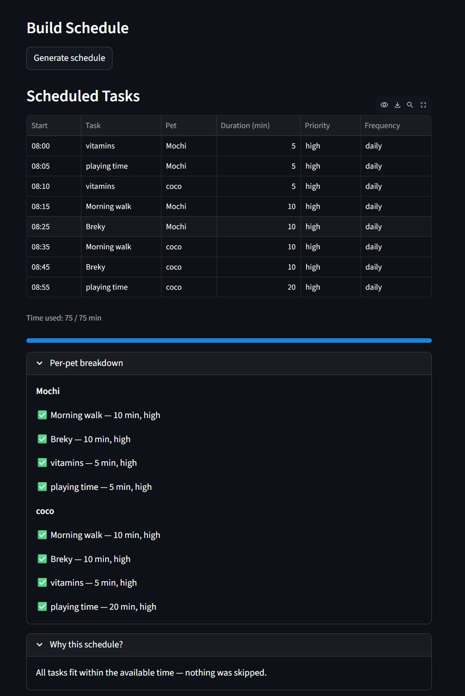

# PawPal+

**PawPal+** is a Streamlit app that helps a pet owner plan daily care tasks for their pets. You enter your pets, add tasks with durations and priorities, and it builds a schedule that fits within your available time.

## Features

- **Priority scheduling**: high-priority tasks like meds and feeding always get scheduled first. Ties within the same priority level go to the shorter task so more fits in the day.
- **Time slots**: each scheduled task gets a real `HH:MM` start time starting from 8:00 AM, chained by duration so nothing overlaps.
- **Sorted schedule display**: the schedule always shows up in chronological order.
- **Task filtering**: you can view tasks by pet or filter by Pending, Completed, or All so you know what's left for each animal.
- **Recurring tasks**: mark a daily or weekly task done and the next one gets added automatically. "As needed" tasks just get marked complete and that's it.
- **Conflict detection**: if two tasks end up overlapping, the app shows a red error at the top of the schedule before you follow it.
- **Time budget check**: if a new task you're trying to add won't fit in the time you have left, the Add Task button grays out and tells you why.
- **Multi-pet support**: you can add multiple pets and tasks get assigned per pet.
- **Remove pets and tasks**: both can be removed from the UI at any time.

## 📸 Demo





## Getting started

### Setup

```bash
python -m venv .venv
source .venv/bin/activate  # Windows: .venv\Scripts\activate
pip install -r requirements.txt
```

### Suggested workflow

1. Read the scenario carefully and identify requirements and edge cases.
2. Draft a UML diagram (classes, attributes, methods, relationships).
3. Convert UML into Python class stubs (no logic yet).
4. Implement scheduling logic in small increments.
5. Add tests to verify key behaviors.
6. Connect your logic to the Streamlit UI in `app.py`.
7. Refine UML so it matches what you actually built.

## Smarter Scheduling

Phase 4 extended the core scheduler with four algorithmic improvements:

**Time-of-day sorting**: Every scheduled task gets an actual `HH:MM` start time, calculated by chaining durations forward from 8:00 AM. `Scheduler.sort_by_time()` uses a lambda on the time string to sort tasks in chronological order, which works because zero-padded `"HH:MM"` strings sort correctly without converting to numbers.

**Task filtering**: `Owner.get_tasks_for_pet(name)` returns only the tasks belonging to a specific pet. `Owner.get_tasks_by_status(completed)` filters across all pets by completion state. Both methods make it easy to answer questions like "what does Mochi still have left today?" without touching unrelated data.

**Recurring tasks**: `Task.next_occurrence()` uses Python's `timedelta` to compute the next due date: `+1 day` for `"daily"` tasks and `+7 days` for `"weekly"` ones. `"as needed"` tasks return `None` and don't auto-recur. `Scheduler.complete_and_reschedule()` wraps this and it marks the task done and immediately adds the next copy to the pet's task list so the owner never has to re-enter it manually.

**Conflict detection**: `Scheduler.detect_conflicts()` checks every pair of scheduled tasks for overlapping time windows using the standard interval overlap test (`a_start < b_end and b_start < a_end`). It returns plain-language warning strings instead of raising exceptions, so the app can surface the issue to the user without crashing.

## Testing PawPal+

Run the full test suite with:

```bash
python -m pytest
```

The suite has 23 tests across five areas:

- **Core task behavior**: marking tasks complete, adding tasks to a pet, verifying completion status
- **Scheduling logic**: priority ordering (high before low), time limit enforcement, exact-boundary fits, empty task lists, and the case where nothing fits at all
- **Sorting**: `sort_by_time()` returns tasks in chronological order; `generate_plan()` assigns sequential `HH:MM` start times from 08:00
- **Recurring tasks**: daily tasks recur +1 day, weekly tasks recur +7 days, "as needed" tasks return `None` and add nothing; `complete_and_reschedule()` handles all three cases
- **Conflict detection**: overlapping windows are flagged, back-to-back tasks are not, identical start times are caught as the degenerate overlap case

**Confidence level: ★★★★★**

The scheduler's core loop, all Phase 4 features, and UI input edge cases are covered. The suite tests happy paths and edge cases including: empty task lists, no pets added, all tasks exceeding available time, the exact-boundary fit, zero-duration tasks, duplicate pet names, and blank name strings. Input validation is intentionally left to the UI layer because the logic layer stores whatever it receives, and the tests document that behavior explicitly.
