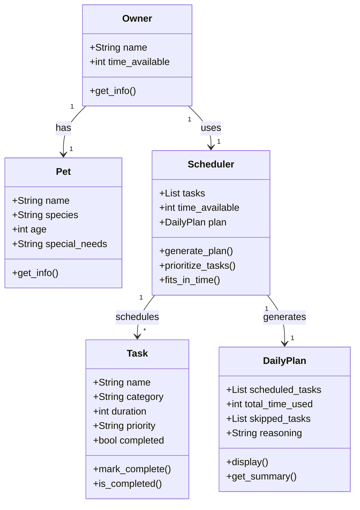

# PawPal+ Project Reflection

## 1. System Design

**a. Initial design**

Before touching any code, I tried to think through what a real user would actually need to do with this app. I landed on three core actions:

1. **Set up their pet and owner info** — The user needs a way to tell the app who they are and basic details about their pet (name, age, any special needs). Without this, the scheduler has no context to work with. So this is really the starting point before anything else can happen.

2. **Add and edit care tasks** — This is the meat of the app. The user should be able to add tasks like a morning walk, medication, feeding, grooming, etc. Each task needs at least a duration (how long it takes) and a priority (how important it is). I also wanted users to be able to come back and edit or remove tasks, not just add them once and be stuck with them.

3. **Generate and view the daily plan** — Once the tasks are in, the user hits some kind of "plan my day" action and the app figures out what order to do things in based on time available and priority. The plan should actually display clearly so they can see what's scheduled and (ideally) understand why the app made those choices.

These three actions basically map to the whole flow: set up → build your task list → get your schedule. That's what shaped my initial class design.

From there I figured out what the actual building blocks (classes) needed to be. I ended up with five:

- **Owner**: holds the user's name and how much free time they have in the day
- **Pet**: holds the pet's name, species, age, and any special needs
- **Task**: the individual care items (walk, feed, meds, etc.) with a duration, priority level, and whether it's been completed
- **Scheduler**: the brain of the app; it takes the task list and available time and figures out what to do and in what order
- **DailyPlan**: stores the final output: which tasks got scheduled, how much time they use, which got skipped, and a plain-language reason for those choices

I kept Owner and Pet as separate classes even though they're related because the owner's time availability is what the Scheduler actually uses to make decisions. It just made more sense to keep that separate from the pet's personal info.

Here's the UML class diagram I drafted with Claude Code:

**b. Design changes**

After reviewing the skeleton I noticed two things that didn't line up with what I actually wanted the app to do.

First, `Owner` had no `pet` attribute even though the UML literally said "Owner has Pet." That relationship just got lost when I translated it to code, so I added `pet: Pet` directly onto the Owner class to fix that.

Second, there was no place to actually store the task list. Tasks were going straight to the Scheduler but nothing was holding onto them in between — like if the user adds a task in the UI, where does it live before scheduling happens? It made more sense to give `Owner` a `tasks` list with `add_task()` and `remove_task()` methods, so the owner is the one managing their task list and then hands it off to the Scheduler when it's time to generate the plan.

---

## 2. Scheduling Logic and Tradeoffs

**a. Constraints and priorities**

- What constraints does your scheduler consider (for example: time, priority, preferences)?
- How did you decide which constraints mattered most?

**b. Tradeoffs**

- Describe one tradeoff your scheduler makes.
- Why is that tradeoff reasonable for this scenario?

---

## 3. AI Collaboration

**a. How you used AI**

- How did you use AI tools during this project (for example: design brainstorming, debugging, refactoring)?
- What kinds of prompts or questions were most helpful?

**b. Judgment and verification**

- Describe one moment where you did not accept an AI suggestion as-is.
- How did you evaluate or verify what the AI suggested?

---

## 4. Testing and Verification

**a. What you tested**

- What behaviors did you test?
- Why were these tests important?

**b. Confidence**

- How confident are you that your scheduler works correctly?
- What edge cases would you test next if you had more time?

---

## 5. Reflection

**a. What went well**

- What part of this project are you most satisfied with?

**b. What you would improve**

- If you had another iteration, what would you improve or redesign?

**c. Key takeaway**

- What is one important thing you learned about designing systems or working with AI on this project?
