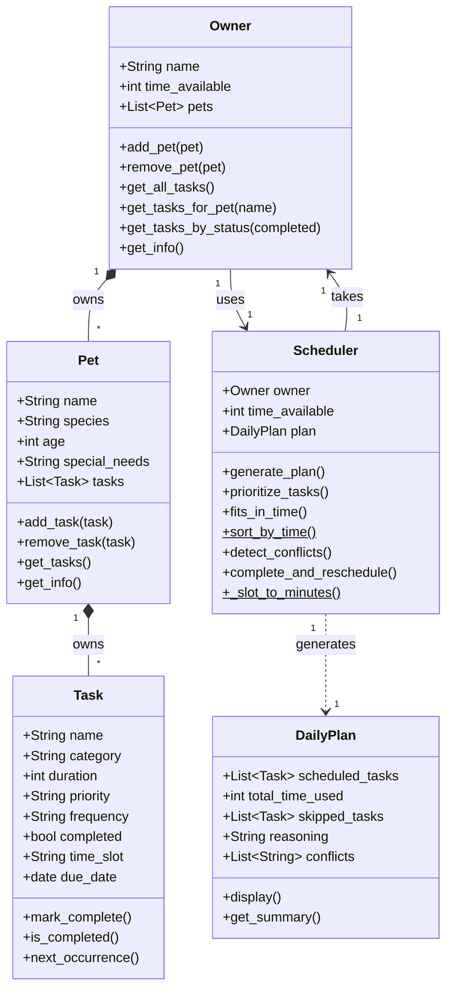

# PawPal+ Project Reflection

## 1. System Design

**a. Initial design**

Before touching any code, I tried to think through what a real user would actually need to do with this app. I landed on three core actions:

1. **Set up their pet and owner info** — The user needs a way to tell the app who they are and basic details about their pet (name, age, any special needs). Without this, the scheduler has no context to work with. So this is really the starting point before anything else can happen.

2. **Add and edit care tasks** — This is the meat of the app. The user should be able to add tasks like a morning walk, medication, feeding, grooming, etc. Each task needs at least a duration (how long it takes) and a priority (how important it is). I also wanted users to be able to come back and edit or remove tasks, not just add them once and be stuck with them.

3. **Generate and view the daily plan** — Once the tasks are in, the user hits some kind of "plan my day" action and the app figures out what order to do things in based on time available and priority. The plan should actually display clearly so they can see what's scheduled and (ideally) understand why the app made those choices.

These three actions basically map to the whole flow: set up → build your task list → get your schedule. That's what shaped my initial class design.

From there I figured out what the actual building blocks (classes) needed to be. I ended up with five:

- **Owner**: holds the user's name and how much free time they have in the day
- **Pet**: holds the pet's name, species, age, and any special needs
- **Task**: the individual care items (walk, feed, meds, etc.) with a duration, priority level, and whether it's been completed
- **Scheduler**: the brain of the app; it takes the task list and available time and figures out what to do and in what order
- **DailyPlan**: stores the final output: which tasks got scheduled, how much time they use, which got skipped, and a plain-language reason for those choices

I kept Owner and Pet as separate classes even though they're related because the owner's time availability is what the Scheduler actually uses to make decisions. It just made more sense to keep that separate from the pet's personal info.

Here's the UML class diagram I drafted with Claude Code:

**b. Design changes**

After reviewing the skeleton I noticed two things that didn't line up with what I actually wanted the app to do.

First, `Owner` had no `pet` attribute even though the UML literally said "Owner has Pet." That relationship just got lost when I translated it to code, so I added `pet: Pet` directly onto the Owner class to fix that.

Second, there was no place to actually store the task list. Tasks were going straight to the Scheduler but nothing was holding onto them in between — like if the user adds a task in the UI, where does it live before scheduling happens? It made more sense to give `Owner` a `tasks` list with `add_task()` and `remove_task()` methods, so the owner is the one managing their task list and then hands it off to the Scheduler when it's time to generate the plan.

---

## 2. Scheduling Logic and Tradeoffs

**a. Constraints and priorities**

The scheduler considers two constraints: **priority level** (high / medium / low) and **available time** (how many minutes the owner has in the day). Priority drives the ordering. High-priority tasks always get considered first. Time availability acts as the hard cutoff if a task doesn't fit in the remaining time, it gets skipped no matter how important it is.

I decided priority mattered most because that's what a real pet owner would care about first. If your dog needs medication (high priority), that has to happen before an enrichment play session (low priority). Time is secondary but non-negotiable because there's no way to schedule a 45-minute walk if only 20 minutes are left.

Within the same priority level, the scheduler breaks ties by duration (shorter tasks first). That's a practical call: fitting more tasks into the day is better than leaving gaps just to run longer ones.

**b. Tradeoffs**

The biggest tradeoff is that my scheduler is **greedy and doesn't backtrack**. It sorts everything by priority + duration, then walks the list once and grabs whatever fits. That's fast and simple, but it can produce a suboptimal result in edge cases.

For example, imagine the owner has 50 minutes left and there's one high-priority task that takes 45 minutes and one medium-priority task that takes 30 minutes. The greedy approach schedules the high-priority task (40 min used), then tries the medium (only 5 min left. doesn't fit), and skips it. But what if the opposite order would have worked? The high-priority task would still get scheduled on the next run. The greedy approach doesn't even look at that possibility.

That tradeoff is totally reasonable here though this is a daily pet care app, not a flight scheduling system. Pet owners don't need a mathematically perfect schedule, they need a fast, explainable one. "I did high-priority things first and fit in whatever else I could" is something a real person would actually say. A backtracking algorithm would be slower, harder to explain, and way overkill for 5–10 tasks a day.

---

## 3. AI Collaboration

**a. How you used AI**

I used AI as more of a sounding board than a code generator. Before writing anything I'd describe what I was trying to do and ask if my approach made sense. That's how I caught the missing `tasks` list on `Owner` early, because I explained my class structure out loud (basically) and it pointed out that there was no place for tasks to actually live between the UI and the Scheduler.

For the conflict detection math I knew I needed to check if two time windows overlapped but I wasn't sure of the cleanest way to write it. I asked for the formula and got `a_start < b_end and b_start < a_end`, which I then went and verified manually with a few example cases before putting it in the code. That was useful because I understood why it works, not just that it works.

The Streamlit wiring was where I leaned on it most for actual code. Session state stuff is repetitive and I already knew what I wanted the UI to do, so having it fill in the boilerplate while I focused on the structure saved a lot of time.

**b. Judgment and verification**

At one point AI suggested using `itertools.combinations(tasks, 2)` for the conflict detection loop instead of the manual `enumerate` + `tasks[i+1:]` approach I had. I looked at both and decided to keep mine. The combinations version is shorter but I had to look up what it does. The manual version is longer but anyone can read it and know exactly what's happening. I ran both against the same inputs to make sure they matched, then kept the one I could actually explain.

There were also a few times where the suggested code would've worked but wasn't quite what I wanted. Like early on it kept putting validation logic inside the model classes and I had to keep steering it back to putting that in the UI instead, since the whole point was to keep the backend clean.

---

## 4. Testing and Verification

**a. What you tested**

I started with the four most obvious behaviors: marking a task complete, adding tasks to a pet, enforcing the time limit, and making sure high-priority tasks come first. Those are the things the whole app depends on so if those break, nothing else matters.

After that I wrote tests for the Phase 4 features as I built them, so sorting, filtering, recurring tasks, and conflict detection each got tested right when I finished the code for them. That made it way easier to catch bugs immediately instead of hunting them down later.

The edge cases came last. I went through the app as if I were a user who didn't know what they were doing and asked "what would break?" No pets added yet, all tasks too long to fit, a task that uses exactly the last available minute, blank names, duplicate pets. Those turned out to be some of the most useful tests because a few of them actually changed how I thought about where validation should live.

**b. Confidence**

Pretty confident in the backend. Every real path through the scheduler has a test and the edge cases are covered. I'd give it a 5/5 for the logic layer.

The UI is less certain because I only tested it by hand. I know the "Add task" disabled state works and the remove buttons work, but those aren't in the automated suite. If something broke there I might not catch it until I ran the app. That's the main thing I'd add more tests for if I had time.

---

## 5. Reflection

**a. What went well**

Keeping `pawpal_system.py` completely separate from Streamlit was the best call I made. I didn't plan it that way on purpose at first, it just made sense not to mix UI code into the logic. But it paid off a lot when I got to testing because I could test the whole scheduling layer without needing a browser open, and when I wired up the UI in Phase 3 it was mostly just calling methods I already trusted.

**b. What you would improve**

I'd add an edit feature. Right now if you make a typo in a task name or pick the wrong duration, you have to delete it and add it again. That's annoying and I noticed it while testing manually. It's not hard to add, I just ran out of time.

I'd also rethink how much the `Owner` class does. It ended up holding pets, handling cross-pet queries, and being the thing you pass into the Scheduler. It works but it feels like too much for one class. I'd probably split out a separate session-level object to handle the aggregation stuff.

**c. Key takeaway**

The UML diagram matters more than I thought going in. I wrote `Owner "1" --> "1" Pet` early on, meaning one owner has one pet. That seemed fine at the time but the minute I wanted to support multiple pets I had to update the Owner class, the Scheduler, the tests, and the UI all at once. If I had thought through "will this ever need multiple pets?" for even two minutes, I would've written `"1" *-- "*"` from the start and it would've been a non-issue. It's not about over-engineering, it's just about actually reading what you're building before you build it.
